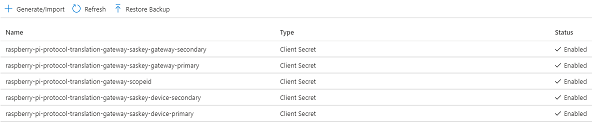

# Raspberry Pi "Translation" Gateway for Azure IoT Central

 

## Overview
This repository is part of a training and project series for Azure IoT Central. The name of the series is "Raspberry Pi Gateway and Arduino Nano BLE Devices for Azure Iot Central" and is located at...

[LINK: Training & Project Site for Raspberry Pi Gateway and Arduino Nano BLE Devices for Azure Iot Central](http://www.hackinmakin.com/Raspberry%20Pi%20Gateway%20and%20BLE/index.html)

This project will enable a Raspberry Pi to act as a "Translation" Gateway and supports a number of scenarios...

* <b>Protocol Translation</b> - Translate the Bluetooth Notify and Charatertics Data into Json and send to Azure Iot Central.
* <b>Protocol & Identity Translation</b> - Translate the Bluetooth Notify and Charatertics Data into Json and send to Azure Iot Central and create Leaf Devices for each BLE Device.
* <b>Opaque Gateway with Identity Translation</b> - Translate the Bluetooth Notify and Charatertics Data into Json and send to Azure Iot Central and transparently Provision Devices for each BLE Device.


## Features
This project is primarly a training and education project that is fully realized and you take the project, components and build out your own working IoT system end to end.


You may want to try the supporting projects for the Nano BLE Devices if you landed here out of sequence.

## Arduino Nano BLE 33 for Azure IoT Central
Here is the link to the Github for the project "Arduino Nano BLE 33 for Azure IoT Central", you should also start and follow up to this point in the training link reference at the start of the Readme.

[LINK: Arduino Nano BLE 33 for Azure IoT Central](https://github.com/Larouex/IoTCNanoBLE33)

We will be working with the following charactertics from our Nano BLE 33 Device and doing Protcol Translation to IoT Central...

* <b>VERSION</b>
* <b>BATTERY CHARGED</b>
* <b>TELEMETRY FREQUENCY</b>
* <b>ACCELEROMETER</b>
* <b>GYROSCOPE</b>
* <b>MAGNETOMETER</b>
* <b>ORIENTATION</b>
* <b>RGB LED</b>

## Arduino Nano BLE 33 SENSE for Azure IoT Central
Here is the link to the Github for the project "Arduino Nano BLE 33 SENSE for Azure IoT Central", you should also start and follow up to this point in the training link reference at the start of the Readme.

[LINK: Arduino Nano BLE 33 SENSE for Azure IoT Central](https://github.com/Larouex/IoTCNanoBLESense33)

We will be working with the following charactertics from our Nano BLE 33 SENSE Device and doing Protcol Translation to IoT Central...

* <b>VERSION</b>
* <b>BATTERY CHARGED</b>
* <b>TELEMETRY FREQUENCY</b>
* <b>ACCELEROMETER</b>
* <b>GYROSCOPE</b>
* <b>MAGNETOMETER</b>
* <b>ORIENTATION</b>
* <b>RGB LED</b>
* <b>BAROMETER</b>
* <b>TEMPERATURE</b>
* <b>HUMIDITY</b>
* <b>MICROPHONE</b>
* <b>AMBIENTLIGHT</b>
* <b>COLOR</b>
* <b>PROXIMITY</b>
* <b>GESTURE</b>

## Setting up Your Development Toolchain
The code in this repository depends on Ardunio, Visual Studio Code and PlatformIO.

### Your Local Machine
The development "toolchain" refers to all of the various tools, SDK's and bits we need to install on your machine to facilitate a smooth experience developing our BLE devices and the Raspberry Pi Gateway device. Our main development tool will be Visual Studio code. It has dependencies on tools from Arduino and other open source projects, but it will be the central place where all our development will occur making it easy to follow along  regardless of which operating system you are working on.

| - | Install These Tools |
|---|---|
|  | [LINK: Python 3 Installation Page](https://www.python.org/downloads/) - Pyhon is the programming language we will use to build applications for the Raspberry Pi. |
|  | [LINK: Visual Studio Code Installation Page](https://code.visualstudio.com/download) - Visual Studio Code is a lightweight but powerful source code editor which runs on your desktop and is available for Windows, macOS and Linux. This is the IDE we will use to write code and deploy to the our BLE Devices and the Raspberry Pi Gateway.  |
|  | [LINK: Docker Desktop Install](https://www.docker.com/products/docker-desktop) - Docker Desktop is an application for MacOS and Windows machines for the building and sharing of containerized applications. |

### Upgrading pip
Pip is the package manager we will use to download packages

On Linux or macOS (Open Terminal):
```
    pip install -U pip
```
On Windows (from a CMD window or Powershell):
```
    python -m pip install -U pip
```

### Install all the Tools for Visual Studio Code
These are a set of tools we will use to develop our apps on the Raspberry Pi. You can open the Extensions sidebar with "Shift+Ctrl+X) or click the icon in the side navigator bar.


### Install the Azure CLI Tooling
The Azure command-line interface (Azure CLI) is a set of commands used to create and manage Azure resources. The Azure CLI is available across Azure services and is designed to get you working quickly with Azure, with an emphasis on automation.

Click the link below and install on your Desktop environment.

[LINK: Install the Azure CLI Tooling](https://docs.microsoft.com/en-us/cli/azure/install-azure-cli?view=azure-cli-latest)


# Setting up the Development Environment on the Raspberry Pi
We will need to setup our Raspberry Pi with all of the capabilities we will need to develop for our Protcol Translation Gateway.

## Connecting to the Raspberry Pi using SSH
We will be connecting to the Raspberry Pi using the remote SSH capability of Visual Studio Code that we installed as part of our development toolchain. When you set the RPi up, we enabled the device to connect to our Wifi network. 

Now we want to find the IP address of our RPi and connect to via VS Code's Remote SSH tools. This will let us develop our code and test our application working remotely connected to the device.

* Here is the documetnation on the extension for VS Code...
[LINK: Remote Development](https://marketplace.visualstudio.com/items?itemName=ms-vscode-remote.vscode-remote-extensionpack)

* Here is how we will connect to the Raspberry Pi...
[LINK: Remote development over SSH](https://code.visualstudio.com/remote-tutorials/ssh/getting-started)

## Connect to the Raspberry Pi

* Click on the green icon in the bottom left of Visual Studio Code, select "Remote-SSH:Connect to Host..."
* Enter in the connection IP. It will be "pi@your IP Address". For example "pi@192.186.1.174"
* You maybe prompted the first time to indetify the Operationing System, choose "Linux"
* Next, enter the Password for the Raspberry Pi, by default is is raspberry. You should change this right away!
* Open our Home Folder on the Raspberry Pi

   

* Click on left side of the main screen "Open Folder" and the navigation helper will open and default to "/home/pi/" press enter as that is right where we want to go!
  * You maybe prompted re-enter your password (which is no longer raspberry, right?)

## Create our Project Folder on the Raspberry Pi

* Click on "New Folder" icon
* Type in "Projects" and press enter to create the folder

   

## Update Python on the Raspberry Pi

From the terminal, run these two commands to bring your Python environments to the latest versions...

```` python
sudo apt-get install python3
sudo apt-get install python3
````
If it all comes back as up to date, then goodness!

## Build our Bluetooth Stack
BlueZ is official Linux Bluetooth protocol stack.

We will be using the latest version of BlueZ. As of the last update to this repository, it was version 5.54. You should work with the latest, stable release in future as experimental features like BLE will stabilize and improve.

Visit the bluez download page and copy the link to the latest source release (under the User Space BlueZ Package section)

Latest version (5.54) since this documentation was updated. Bet sure to get the latest.
http://www.bluez.org/


### Install Dependencies for BlueZ
````bash
sudo apt-get install -y git bc libusb-dev libdbus-1-dev libglib2.0-dev libudev-dev libical-dev
sudo apt-get install -y libreadline-dev autoconf
````
### Install json-c
````bash
cd ~
wget https://s3.amazonaws.com/json-c_releases/releases/json-c-0.13.tar.gz
tar -xvf json-c-0.13.tar.gz
cd json-c-0.13/
./configure --prefix=/usr --disable-static && make
sudo make install
````

### Install ell for BlueZ
````bash
cd ~
wget https://mirrors.edge.kernel.org/pub/linux/libs/ell/ell-0.6.tar.xz
tar -xvf ell-0.6.tar.xz
cd ell-0.6/
sudo ./configure --prefix=/usr
sudo make
sudo make install
````

### Get BlueZ Source Code, Compile/Build and Install
```` bash
cd ~
wget http://www.kernel.org/pub/linux/bluetooth/bluez-5.54.tar.xz
tar xvf bluez-5.54.tar.xz
cd bluez-5.54
sudo apt-get update
sudo apt-get install -y libusb-dev libdbus-1-dev libglib2.0-dev libudev-dev libical-dev libreadline-dev
./configure --enable-library --enable-mesh --prefix=/usr --mandir=/usr/share/man --sysconfdir=/etc --localstatedir=/var
sudo make
sudo make install
````

We now need to let the Rasp[berry Pi's Raspian OS know that we want to use our newly compiled BlueZ Bluetoothh stack and tell systemd to use the new bluetooth daemon:

After opening this file, bluetooth.service, make sure the ExecStart line points to your new daemon
in /usr/libexec/bluetooth/bluetoothd, as shown in the screenshot below...

```` bash
sudo vi /lib/systemd/system/bluetooth.service
````


You still need to create a symlink from the old bluetoothd to the new one. First, rename the old file for backup... 

```` bash
sudo cp /usr/lib/bluetooth/bluetoothd /usr/lib/bluetooth/bluetoothd-543.orig
cd /usr/lib/bluetooth/
ls -l
````

You should see this oputput...


Create the symlink using the commands below...
```` bash
sudo ln -sf /usr/libexec/bluetooth/bluetoothd /usr/lib/bluetooth/bluetoothd
sudo systemctl daemon-reload
````

Finally; Let's double check the version of bluetoothd and meshctl...
```` bash
bluetoothd -v
meshctl -v
````
You should see this oputput...


##### Start Bluetooth and Run Automatically

```` bash
systemctl status bluetooth
sudo systemctl start bluetooth
````

Set to run automatically...
```` bash
sudo systemctl enable bluetooth
````

## Enable Bluetooth Low Energy Features
One final configuration change you can make is to enable the bluetooth low energy features in bluez.  These are special APIs that allow bluez to interact with bluetooth low energy devices, however they're still in development and put behind an experimental flag that must be enabled first.

To enable bluez's experimental features like BLE you can modify the bluez service configuration.  Edit this configuration by running:

```` bash
sudo nano /lib/systemd/system/bluetooth.service
````

Enable the experimental features by adding --experimental to the ExecStart line, for example the configuration should look like:


Save the file and exit the editor by pressing 
* Ctrl-o
* Enter
* Ctrl-x.

Now tell systemd to reload its configuration files by running:

```` bash
sudo systemctl daemon-reload
sudo systemctl restart bluetooth
````

Once the bluez service is running you can check the experimental features are enabled by running the status command again.  You should see output similar to the following (notice the --experimental on the last line):

```` bash
systemctl status bluetooth
````


### Verify that Bluetooth is Working for LE

```` bash
hciconfig

hci0:   Type: Primary  Bus: UART
        BD Address: DC:A6:32:B1:BD:39  ACL MTU: 1021:8  SCO MTU: 64:1
        UP RUNNING 
        RX bytes:1710 acl:0 sco:0 events:118 errors:0
        TX bytes:7521 acl:0 sco:0 commands:118 errors:0
````

Next up I started monitoring one of my Nano BLE 33 Devices in Advertising mode and ran this command... 
```` bash
sudo hcitool lescan
````
The Nano BLE Sense device is detected in the scan from the Raspberry Pi and we are up and working!

 

<b>NOTE:</b> If you get an error with LE Scan you can bring down the specific interface (i.e. hci0 = onboard bluetooth, hci1 = could a USB installed Bluetooth antennae, etc), try these commands...
```` bash
sudo hciconfig hci0 down
sudo hciconfig hci0 up
````

## Getting Started with our Gateway Coding
Now that we have everything ready in our development tool chains and OS environments on our desktop and the Raspberry Pi, let's get started coding! We need to next clone the project and install libraries/dependancies.

### Setup all our Bluetooth Python Libraries for BlueZ
````bash
cd ~
sudo apt-get install bluez python-bluez
sudo apt-get install libbluetooth-dev
wget https://github.com/pybluez/pybluez/archive/master.tar.gz
tar xvf master.tar.gz
cd pybluez-master
sudo python3 setup.py install
sudo apt-get install libbluetooth-dev
sudo apt-get install libglib2.0-dev
sudo pip3 install bluepy
sudo python3 setup.py install
````

###  Install required packages
```` bash
sudo apt install libsdl2-dev libsdl2-image-dev libsdl2-mixer-dev libsdl2-ttf-dev \
   pkg-config libgl1-mesa-dev libgles2-mesa-dev \
   python-setuptools libgstreamer1.0-dev git-core \
   gstreamer1.0-plugins-{bad,base,good,ugly} \
   gstreamer1.0-{omx,alsa} python-dev libmtdev-dev \
   xclip xsel libjpeg-dev libgpiod2
````

### Clone this project "Raspberry Pi "Protocol Translation" Gateway for Azure IoT Central"...
````bash
cd ~
cd Projects
git clone https://github.com/Larouex/IoTCRaspberryPiProtocolTranslationGateway.git
cd IoTCRaspberryPiProtocolTranslationGateway
pip3 install -r requirements.txt
````
We are now ready!

# Overview of the Gateway Project 

<b>PROTIP!</b> Consider all of the configuration work it took to prepare our Raspberry Pi, you may want to clone your SD card and tuck it away for ease of getting this point in future with a clean development state. Based on your OS, there are a number of tools out there to clobe the SD card image. You can then use your image backup with "balenaEtcher" to flash your card.


## SECRETS!!! - Azure Connectivity and Protecting Your Secrets
<b>NOTE:</b> You can skip this section if you do not plan to use Azure Key Vault to Store and Access secrets.

Azure IoT Central is what we using for capturing Telemetry and Managing out Gateway and Devices. It is a powerful SaaS offering and we will be using the tools and visualizations to build out a rich application for our scenario. In order to connect our devices and gateway to IoT Central, we need to manage a set of secrets and we will store those secrets in Azure Key Vault. I highly recommend that you do this so you do not make a mistake and expose access to your application, gateway or devices.

I am going to assume the following when we work with Azure and Azure Portal...

* That you already have an Azure Account (If you don't, get started here [LINK: Create your Azure free account today](https://azure.microsoft.com/en-us/free/))
* That you have sufficient permissions in your Azure account to create Resource Groups and Resources
* That you are familiar creating and using resources with the Azure CLI or the Azure Portal [LINK: Azure Portal](https://portal.azure.com/))

### Create our Connection Secrets...
| Name | Secret (IoT Central Admin [Device Connection] Page)  | Content Type |
|---|---|---|
| raspberry-pi-protocol-translation-gateway-scopeid | Admin, Device Connection, Copy [ID scope] | Client Secret |
| raspberry-pi-protocol-translation-gateway-saskey-device-primary | Admin, Device Connection, Devices, View Keys, Copy [Primary Key] | Client Secret |
| raspberry-pi-protocol-translation-gateway-saskey-device-secondary | Admin, Device Connection, Devices, View Keys, Copy [Secondary Key] | Client Secret |
| raspberry-pi-protocol-translation-gateway-saskey-gateway-primary | Admin, Device Connection, Azure Edge devices, View Keys, Copy [Primary Key] | Client Secret |
| raspberry-pi-protocol-translation-gateway-saskey-gateway-secondary | Admin, Device Connection, Azure Edge devices, View Keys, Copy [Secondary Key] | Client Secret |

Once these are all created in Key Vault, your list should look like this...
 

https://docs.microsoft.com/en-us/azure/key-vault/certificates/quick-create-python

## Get Your Credentials for Azure Login
<b>NOTE:</b> You can skip this section if you do not plan to use Azure Key Vault to Store and Access secrets.

* Open a Terminal or Powershell session
* Login to the Azure CLI...

````bash
az login
````

* If the CLI can open your default browser, it will do so and load an Azure sign-in page.
* Otherwise, open a browser page at https://aka.ms/devicelogin and enter the authorization code displayed in your terminal.
* Sign in with your account credentials in the browser.

````bash
az ad sp create-for-rbac --name http://raspberry-pi-protocol-translation-gateway --skip-assignment
````

````json
{
  "appId": "<your appID>",
  "displayName": "raspberry-pi-protocol-translation-gateway",
  "name": "http://raspberry-pi-protocol-translation-gateway",
  "password": "<your password>",
  "tenant": "<your tenant>"
}
````

az keyvault set-policy --name larouex-prod-key-vault --spn "9afd63c4-91e2-4054-b068-aeb21dc291eb" --secret-permissions get set list delete backup recover restore purge

````bash
az keyvault set-policy --name <your key vault url> --spn <your password> --secret-permissions get set list delete backup recover restore purge
````

## Configure our Secrets for Local Development
There is a file in the root folder of the project named "secrets_template.json" and this file outlines the shape of Json we use to retreive secrets. It supports Local Secrets and Key Vault usage. Copy the "secrets_template.json" to a new file named "secrets.json" in the root folder of the project. Open this file in Visual Studio Code and let's start configuring the options.

<b>IMPORTANT: Make sure to check your .gitignore to verify that "secrets.json" is in the list so it does not get checked in! The file should be dithered in your Visual Studio Code Explorer window.</b>


### I want to use the security and awesomeness of Key Vault!
See the Json below the bullets for reference...

* Set "UseKeyVault" to true
* From the Azure Portal, Goto your Key Vault Resource
* Goto Secrets
* Click onto your secret for Scope ID that we set up previously
* Click the copy button next to the "Secret Identifier"
* Paste it into the "KeyVaultUri" in the "secrets.json" file.
* Highlight and cut the remainder of url after .../secrets/ 
* Paste into the ScopeId field
* Repeat for all the secrets we setup previously and put into the right fields!

<b>Your file should look like this when completed...</b>
````json
{
  "UseKeyVault": true,
  "ProvisioningHost": "global.azure-devices-provisioning.net",
  "LocalSecrets": {
    "ScopeId": "",
    "DeviceConnect":{
      "SaSKeys":{
          "Primary": "",
          "Secondary": ""
      }
    },
    "GatewayConnect":{
      "SaSKeys":{
          "Primary": "",
          "Secondary": ""
      }
    }
  },
  "KeyVaultSecrets":{
    "KeyVaultUri": "<Your Key Vault UIR>",
    "TenantId":"<Your Tenant ID>",
    "ClientId":"<Your Client ID>",
    "ClientSecret":"<Your Client Secret>",
    "ScopeId": "raspberry-pi-protocol-translation-gateway-scopeid",
    "DeviceConnect":{
      "SaSKeys":{
          "Primary": "raspberry-pi-protocol-translation-gateway-saskey-device-primary",
          "Secondary": "raspberry-pi-protocol-translation-gateway-saskey-device-secondary"
      }
    },
    "GatewayConnect":{
      "SaSKeys":{
          "Primary": "raspberry-pi-protocol-translation-gateway-saskey-gateway-primary",
          "Secondary": "raspberry-pi-protocol-translation-gateway-saskey-gateway-secondary"
      }
    }
  }
}
````
Save the file and you can ignore the "LocalSecrets" section.

### I don't want to use Key Vault!
If you are working locally and do not want to implement the security and awesomeness of Key Vault, then go ahead and set "UseKeyVault" to false. Copy all our your SaS key values from the Admin, Device Connection page in IoT Central...

````json
{
  "UseKeyVault": false,
  "ProvisioningHost": "global.azure-devices-provisioning.net",
  "LocalSecrets": {
    "ScopeId": "<Your Scope ID from IoT Central Device Connect Page>",
    "DeviceConnect":{
      "SaSKeys":{
          "Primary": "<Your Primary Key from IoT Central Device Connect Page>",
          "Secondary": "<Your Secondary Key from IoT Central Device Connect Page>"
      }
    },
    "GatewayConnect":{
      "SaSKeys":{
          "Primary": "<Your Gateway Primary Key from IoT Central Device Connect Page>",
          "Secondary": "<Your Gateway Secondary Key from IoT Central Device Connect Page>"
      }
    }
  },
  "KeyVaultSecrets":{
    "KeyVaultUri": "",
    "TenantId":"",
    "ClientId":"",
    "ClientSecret":"",
    "ScopeId": "",
    "DeviceConnect":{
      "SaSKeys":{
          "Primary": "",
          "Secondary": ""
      }
    },
    "GatewayConnect":{
      "SaSKeys":{
          "Primary": "",
          "Secondary": ""
      }
    }
  }
}
````
Save the file and you can ignore the "KeyVaultSecrets" section.

### Set up the Credentials in the Raspberry Pi
Let's go back to a terminal window and setup the variables on the Raspberry Pi. Use the values from the generated Jasn to set AZURE_CLIENT_ID ("appId"), AZURE_CLIENT_SECRET ("password") and AZURE_TENANT_ID ("tenant") environment variables. 

````bash
export AZURE_CLIENT_ID="<your appId>"
export AZURE_CLIENT_SECRET="<your password>"
export AZURE_TENANT_ID="<your tenant>"
export AZURE_SUBSCRIPTION_ID="<your tenant>"
````
Authorize the service principal to perform key operations in your Key Vault:

https://www.bluetooth.com/specifications/assigned-numbers/generic-access-profile/

## Scanning and Capturing BLE Devices
The next step is to turn on your BLE Devices and Scan for them using our Raspberry Pi Gateway. The scanning for BLE devices used BlueZ BLESCAN and this component requires SUDO access. I created the script to not require any installation of additional packages and also made it an external script to the primary gateway code.

 

In your project, there is a configuration file at the root of the project folder called "devicescache.json" [LINK: devicescache.json](./devicescache.json) and the structure of this file is shown below...

````json
{
  "DeviceCapabilityModels": [
    {
      "DeviceNamePrefix": "larouex-ble-sense-",
      "DCM": "urn:larouexiot:nanoble33sense:1",
      "DeviceInfoInterface": "urn:azureiot:DeviceManagement:DeviceInformation:1",
      "DeviceInfoInterfaceInstanceName": "DeviceInformationInterface",
      "NanoBLEInterface": "urn:larouexiot:nanoble33sense:NanoBLE33SenseInterface:1",
      "NanoBLEInterfaceInstanceName": "NanoBLE33SenseInterface"
    },
    {
      "DeviceNamePrefix": "larouex-ble-33-",
      "DCM": "urn:larouexiot:nanoble33:1",
      "DeviceInfoInterface": "urn:azureiot:DeviceManagement:DeviceInformation:1",
      "DeviceInfoInterfaceInstanceName": "DeviceInformationInterface",
      "NanoBLEInterface": "urn:larouexiot:nanoble33:NanoBLE33Interface:1",
      "NanoBLEInterfaceInstanceName": "NanoBLE33Interface"
    }
  ],
  "Devices": [
    {
      "DeviceName": "Simulated Device",
      "Address": "6A:6A:6A:6A:6A:6A",
      "LastRSSI": "-91 dB",
      "DCM": "urn:larouexiot:nanoble33:1",
      "DeviceInfoInterface": "urn:larouexiot:nanoble33sense:NanoBLE33SenseInterface:1",
      "DeviceInfoInterfaceInstanceName": "DeviceInformationInterface",
      "NanoBLEInterface": "urn:larouexiot:nanoble33sense:NanoBLE33SenseInterface:1",
      "NanoBLEInterfaceInstanceName": "NanoBLE33Interface",
      "LastProvisioned": null
    }
  ]
}
````
Let's review the file stucture...

#### DeviceCapabilityModels
This section is the "pattern" match for your BLE devices. Let's jump back (if you have not built out a Nano BLE device for this project, you should do that now or have a BLE simulation running using LightBlue, etc.) to our Nano BLE projects where we have a file that is global to the project called "Platform.ini" and in that file we have designated the following when building and deploying to the device...

````yaml
[common_env_data]
build_flags =
    -D VERSION=1.0.0.1
    -D DCM="urn:larouexiot:nanoble33:1"
    -D DEVICE_NAME="larouex-ble-33-0002"
    -D SERVICE_UUID="6F165338-0001-43B9-837B-41B1A3C86EC1"
    -D DEBUG=1
````
This section in "devicescache.json" identifies the pattern that your device advertises via BLE...
````json
  "DeviceCapabilityModels": [
    {
      "DeviceNamePrefix": "larouex-ble-sense-",
      "DCM": "urn:larouexiot:nanoble33sense:1",
      "DeviceInfoInterface": "urn:azureiot:DeviceManagement:DeviceInformation:1",
      "DeviceInfoInterfaceInstanceName": "DeviceInformationInterface",
      "NanoBLEInterface": "urn:larouexiot:nanoble33sense:NanoBLE33SenseInterface:1",
      "NanoBLEInterfaceInstanceName": "NanoBLE33SenseInterface"
    },
    {
      "DeviceNamePrefix": "larouex-ble-33-",
      "DCM": "urn:larouexiot:nanoble33:1",
      "DeviceInfoInterface": "urn:azureiot:DeviceManagement:DeviceInformation:1",
      "DeviceInfoInterfaceInstanceName": "DeviceInformationInterface",
      "NanoBLEInterface": "urn:larouexiot:nanoble33:NanoBLE33Interface:1",
      "NanoBLEInterfaceInstanceName": "NanoBLE33Interface"
    }
  ],
  ...
````
* <b>DeviceNamePrefix</b> - The naming pattern your BLE devices start with...
* <b>DCM</b> - The Device Capability Model Identity in IoT Central

#### The Devices
The Devices section of the file is an array of devices that match your naming pattern. There is a "dummy" record for a Simulated device and this is there for reference and is ignored in all situations.
````json
{
  ...
  "Devices": [
    {
      "DeviceName": "Simulated Device",
      "Address": "6A:6A:6A:6A:6A:6A",
      "LastRSSI": "-91 dB",
      "DCM": "urn:larouexiot:nanoble33:1",
      "DeviceInfoInterface": "urn:larouexiot:nanoble33sense:NanoBLE33SenseInterface:1",
      "DeviceInfoInterfaceInstanceName": "DeviceInformationInterface",
      "NanoBLEInterface": "urn:larouexiot:nanoble33sense:NanoBLE33SenseInterface:1",
      "NanoBLEInterfaceInstanceName": "NanoBLE33Interface",
      "LastProvisioned": null
    }
  ]
}
````
Let's run our scan devices Python script to find our advertising devices. I currently have two BLE devices up and adverstising before I executed the script...

* larouex-ble-sense-0001
* larouex-ble-33-0002

#### Scan Devices Options
Here are the options for the Scan Device script that you can override...

* <b>-h or --help</b> - Print out this Help Information
* <b>-v or --verbose</b> -  Debug Mode with lots of Data will be Output to Assist with Debugging
* <b>-b or --btiface</b> - Bluetooth Interface? '0' = Built in or '1' if you added a BT Device and Antenna, etc. (default=0)
* <b>-r or --resethci</b> - OS command to Reset the Bluetooth Interface (default=false)
* <b>-s or --scanseconds</b> - Number of Seconds the BLE Scan should Scan for Devices (default=10)

````bash
sudo python3 ./scandevices -v -r -b 0 - 12
>>>
INFO: Verbose mode...
INFO: Bluetooth Interface Override...0
INFO: Scan Seconds Override...12
INFO: Bluetooth Reset Interface mode...
INFO: Loaded Config file: {'BluetoothInterface': 0, 'ScanSeconds': 10.0}
INFO: resethci: True
INFO: Bluetooth Interface: 0
INFO: Loaded Devices Cache file: {...}
INFO: hciconfig down...
INFO: hciconfig up...
WARNING: Please Wait: Scanning for BLE Devices Advertising...(12 Seconds)
WARNING: [FOUND NEW DEVICE] larouex-ble-33-0002
INFO: [DEVICE DCM] urn:larouexiot:nanoble33:1
WARNING: [FOUND NEW DEVICE] larouex-ble-sense-0001
INFO: [DEVICE DCM] urn:larouexiot:nanoble33sense:1
INFO: Updated Devices Cache file: {...}
````
Lot's of Information, let's run without the Debug INFO...
````bash
sudo python3 ./scandevices -r -b 0 - 12
>>>
WARNING: Please Wait: Scanning for BLE Devices Advertising...(12 Seconds)
WARNING: [FOUND NEW DEVICE] larouex-ble-sense-0001
WARNING: [FOUND NEW DEVICE] larouex-ble-33-0002
````
Nice and terse. Let's run it again for Idempotency...
````bash
sudo python3 ./scandevices -r -b 0 - 12
>>>
WARNING: Please Wait: Scanning for BLE Devices Advertising...(12 Seconds)
WARNING: [ALREADY DISCOVERED, SKIPPING] larouex-ble-sense-0001
WARNING: [ALREADY DISCOVERED, SKIPPING] larouex-ble-33-0002
````
Here is what our devicescache.json file looks like with all the data captured...
````json
{
  "DeviceCapabilityModels": [
    {
      "DeviceNamePrefix": "larouex-ble-sense-",
      "DCM": "urn:larouexiot:nanoble33sense:1",
      "DeviceInfoInterface": "urn:azureiot:DeviceManagement:DeviceInformation:1",
      "DeviceInfoInterfaceInstanceName": "DeviceInformationInterface",
      "NanoBLEInterface": "urn:larouexiot:nanoble33sense:NanoBLE33SenseInterface:1",
      "NanoBLEInterfaceInstanceName": "NanoBLE33SenseInterface"
    },
    {
      "DeviceNamePrefix": "larouex-ble-33-",
      "DCM": "urn:larouexiot:nanoble33:1",
      "DeviceInfoInterface": "urn:azureiot:DeviceManagement:DeviceInformation:1",
      "DeviceInfoInterfaceInstanceName": "DeviceInformationInterface",
      "NanoBLEInterface": "urn:larouexiot:nanoble33:NanoBLE33Interface:1",
      "NanoBLEInterfaceInstanceName": "NanoBLE33Interface"
    }
  ],
  "Devices": [
    {
      "DeviceName": "Simulated Device",
      "Address": "6A:6A:6A:6A:6A:6A",
      "LastRSSI": "-91 dB",
      "DCM": "urn:larouexiot:nanoble33:1",
      "DeviceInfoInterface": "urn:larouexiot:nanoble33sense:NanoBLE33SenseInterface:1",
      "DeviceInfoInterfaceInstanceName": "DeviceInformationInterface",
      "NanoBLEInterface": "urn:larouexiot:nanoble33sense:NanoBLE33SenseInterface:1",
      "NanoBLEInterfaceInstanceName": "NanoBLE33Interface",
      "LastProvisioned": null
    },
    {
      "DeviceName": "larouex-ble-sense-0001",
      "Address": "c7:94:90:1c:8f:3c",
      "LastRSSI": "-64 dB",
      "DCM": "urn:larouexiot:nanoble33sense:1",
      "DeviceInfoInterface": "urn:azureiot:DeviceManagement:DeviceInformation:1",
      "DeviceInfoInterfaceInstanceName": "DeviceInformationInterface",
      "NanoBLEInterface": "urn:larouexiot:nanoble33sense:NanoBLE33SenseInterface:1",
      "NanoBLEInterfaceInstanceName": "NanoBLE33SenseInterface",
      "LastProvisioned": null
    },
    {
      "DeviceName": "larouex-ble-33-0002",
      "Address": "fb:0a:8d:5f:79:e4",
      "LastRSSI": "-59 dB",
      "DCM": "urn:larouexiot:nanoble33:1",
      "DeviceInfoInterface": "urn:azureiot:DeviceManagement:DeviceInformation:1",
      "DeviceInfoInterfaceInstanceName": "DeviceInformationInterface",
      "NanoBLEInterface": "urn:larouexiot:nanoble33:NanoBLE33Interface:1",
      "NanoBLEInterfaceInstanceName": "NanoBLE33Interface",
      "LastProvisioned": null
    }
  ]
}
````
That is an overview of  the purpose of scandevices.py: It finds advertising devices using BLEScan and and writes the data to the devicescache.json [LINK: devicescache.json](./devicescache.json). That is all that is does, we have not provisioned our devices as of yet in Azure Iot Central and that is our next step!

I encourage you to look over the scandevices.py [LINK: scandevices.py](./scandevices.py) and the class that is uses to do all of the scanning and configuration [LINK: classes/scanfordevices.py](./classes/scanfordevices.py).

## Provisioning our Devices in Azure IoT Central
The next thing we get to do is work on our Device Template in Azure IoT Central. The first gateway type we are going to create for Provisioning is a "TRANSPARENT" gateway where it looks like our BLE devices are connected directly to IoT Central.

Let's get started at IoT Central and create an application [LINK: Welcome to IoT Central](http://apps.azureiotcentral.com/ )

* Click the "My Apps" on the sidebar
* Select "+ New Application" from the main bar at the top
* Click on the icon for "Custom apps"
* Fill out the form with your application name and details and click "Create" button when done.

* Next up, let's choose "Device templates" from the sidebar and Select "+ New" from the main bar at the top and you will be in the following page...

* Click "IoT device" Icon and click "Next: Customize" button

   

* Enter "NanoBLE33Sense" in the "Device template name" field click "Next: Review" button
  
       

* Click "Create" button
 
       
 
* Click the "Import capability model" Icon

       
 
* Select the file named "nanoble33sense.json" from the location you cloned the project onto your desktop machine (i.e. ./IoTCRaspberryPiProtocolTranslationGateway/devicecapabilitymodels)

  


Provisioning follows the same pattern as ScanDevices in that we have separated this script into a "stand-alone" operation. 

There are excellent tutorials on connecting devices to IoT Central and using Device Provisioning Services online and we won't try to repeat that here. If you are not familar, take a break and visit these topics...

* [LINK: Get connected to Azure IoT Central](https://docs.microsoft.com/en-us/azure/iot-central/core/concepts-get-connected)
* [LINK: Tutorial: Create and connect a client application to your Azure IoT Central application (Python)](https://docs.microsoft.com/en-us/azure/iot-central/core/tutorial-connect-device-python)

Provisioning in our Gateway project is one of key pillars of capabilities we have created and we have lots of options so you can try the various Gateway scenarios. Let's look at the options...

* <b>-h or --help</b> - Print out this Help Information
* <b>-v or --verbose</b> -  Debug Mode with lots of Data will be Output to Assist with Debugging
* <b>-p or --provisioningscope</b> - Provisioning Scope give you fine grained control over the devices you want to provision. 
  * <b>ALL</b> - Re-Provision Every device listed in the DevicesCache.json file
  * <b>NEW</b> - Only Provision Devices DevicesCache.json file that have "LastProvisioned=Null"
  * <b>device name</b> - Provision a Specifc Device in DevicesCache.json file
* <b>-g or --gatewaytype</b> - Indicate the Type of Gateway Relationship
  * <b>OPAQUE</b> - Devices will look like Stand-Alone Devices in IoT Central
  * <b>TRANSPARENT</b> - Devices will look like Stand-Alone Devices in IoT Central
  * <b>PROTOCOL</b> - IoT Central will show a Single Gateway and all Data is Associated with the Gateway
  * <b>PROTOCOLWITHIDENTITY</b> - IoT Central will show a Single Gateway and Leaf Devices

